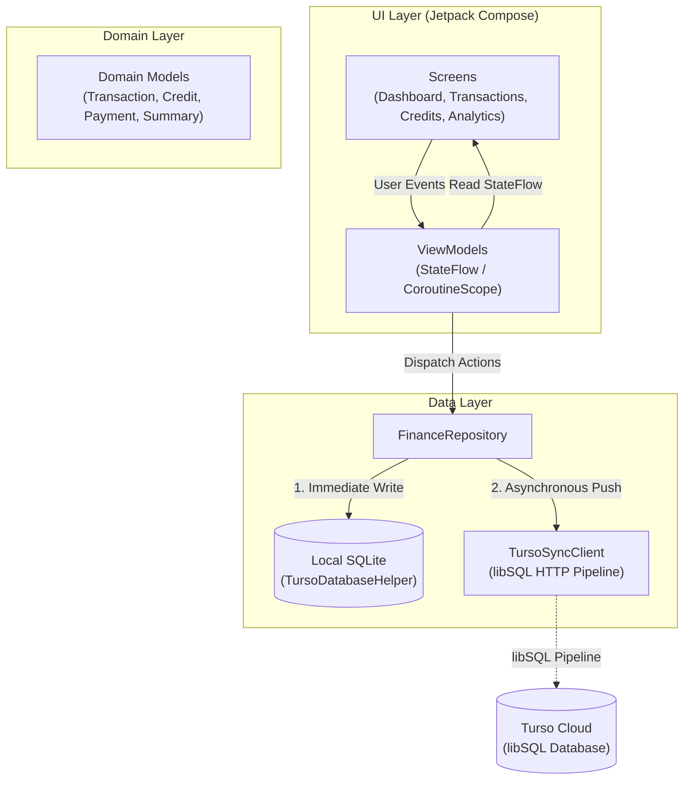

<p align="center">
  
</p>

<h1 align="center">App Finance</h1>

<p align="center">
  <strong>Native Android personal finance and credit tracker with local-first SQLite persistence and Turso (libSQL) cloud synchronization.</strong>
</p>

<p align="center">
  
  
  
  
  
</p>

---

## Overview

**App Finance** is an offline-first Android application designed for budgeting, expense categorization, and credit/debt tracking. The application pairs native local SQLite persistence with remote synchronization powered by the **Turso (libSQL) HTTP Pipeline API**, delivering instant local responsiveness with cloud resilience and automatic credential failover.

Built entirely with **Kotlin 2.0** and **Jetpack Compose (Material 3)**, it features a fluid Cupertino-inspired interface, reactive state management using Kotlin Coroutines and `StateFlow`, and built-in connection diagnostics.

---

## Key Features

- **Financial Dashboard**: Real-time aggregation of total balance, monthly income, operating expenses, and overall debt liability.
- **Transaction Management**: Record income and expense entries with category tagging, formatted currency displays, and date tracking.
- **Credit & Debt Tracking**: Monitor credit cards and personal loans, calculate remaining balances dynamically, and log partial payments (*abonos*) that automatically generate corresponding expense records.
- **Spending Analytics**: Categorical breakdowns and financial summaries to assess spending habits and debt-to-income distribution.
- **Cupertino Dual Theme**: Polished iOS-inspired design with adaptive Dark and Light mode color schemes and dynamic system status bar contrast.
- **Centralized String Resources**: Over 60 UI strings localized into `res/values/strings.xml`, ready for internationalization (i18n).
- **Local-First Synchronization**: All operations persist locally to SQLite immediately, then sync to Turso Cloud asynchronously via HTTP pipelines.
- **Resilient Cloud Integration**: Built-in credential failover that detects HTTP 401 unauthorized responses and seamlessly switches between primary and backup authentication tokens.
- **Diagnostics Dashboard**: Built-in sheet reporting local SQLite health, remote pipeline latency, HTTP status codes, and remote schema initialization controls.

---

## Architecture

The project follows Clean Architecture and MVVM principles using Unidirectional Data Flow (UDF):



---

## Tech Stack

| Component | Technology | Version / Details |
| :--- | :--- | :--- |
| **Language** | Kotlin | `2.0.0` (JVM 11 target) |
| **UI Toolkit** | Jetpack Compose & Material 3 | Compose BOM `2024.09.00` |
| **Navigation** | AndroidX Navigation Compose | `2.8.2` |
| **Local Database** | Native Android SQLite | Native `SQLiteOpenHelper` |
| **Cloud Database** | Turso (libSQL) | HTTP Pipeline API v2 via `OkHttp 4.12.0` |
| **JSON Handling** | Google Gson | `2.10.1` |
| **Asynchrony** | Kotlin Coroutines & Flow | `StateFlow` + `Dispatchers.IO` |
| **Build System** | Gradle Kotlin DSL | AGP `8.9.0-alpha07` |

---

## Getting Started

### Prerequisites

- **JDK 17 or higher** (required by Android Gradle Plugin 8.9+).
- **Android SDK** with build tools and platform API 35 installed.
- **Android Studio** (Koala / Ladybug or newer) or standard command-line tools.

### Setup Instructions

1. **Clone the repository**:
   ```bash
   git clone https://github.com/gtamayoc/app-finance.git
   cd app-finance
   ```

2. **Configure Android SDK**:
   Create or verify the `local.properties` file in the project root:
   ```properties
   sdk.dir=C:\\Users\\<USER>\\AppData\\Local\\Android\\Sdk
   ```
   *(On macOS/Linux: `sdk.dir=/Users/<USER>/Library/Android/sdk`)*

3. **Verify Java Environment**:
   > [!IMPORTANT]
   > Ensure `JAVA_HOME` points to a valid JDK 17+ installation before running Gradle tasks.

   **Windows (PowerShell)**:
   ```powershell
   $env:JAVA_HOME = "C:\Program Files\Java\jdk-17"
   .\gradlew.bat --version
   ```

   **macOS / Linux**:
   ```bash
   export JAVA_HOME="/path/to/jdk-17"
   ./gradlew --version
   ```

---

## Build & Test Commands

Use the Gradle wrapper to build and test the application from the command line:

| Task | Windows (PowerShell) | macOS / Linux | Output Location |
| :--- | :--- | :--- | :--- |
| **Run Unit Tests** | `.\gradlew.bat testDebugUnitTest` | `./gradlew testDebugUnitTest` | `app/build/reports/tests/` |
| **Run Linter** | `.\gradlew.bat lintDebug` | `./gradlew lintDebug` | `app/build/reports/lint-results-debug.html` |
| **Assemble Debug APK** | `.\gradlew.bat assembleDebug` | `./gradlew assembleDebug` | `app/build/outputs/apk/debug/app-debug.apk` |
| **Assemble Release APK** | `.\gradlew.bat assembleRelease` | `./gradlew assembleRelease` | `app/build/outputs/apk/release/` |
| **Clean Build** | `.\gradlew.bat clean` | `./gradlew clean` | `build/`, `app/build/` |

> [!TIP]
> To execute a targeted unit test class, pass the test filter argument:
> ```powershell
> # Run CurrencyFormatter unit tests
> .\gradlew.bat testDebugUnitTest --tests "com.gtc.app_finance.CurrencyFormatterTest"
>
> # Run FinancialSummary calculation logic tests
> .\gradlew.bat testDebugUnitTest --tests "com.gtc.app_finance.FinancialSummaryLogicTest"
>
> # Run Entity & Domain mapping tests
> .\gradlew.bat testDebugUnitTest --tests "com.gtc.app_finance.EntityMappingTest"
> ```

---

## Cloud Sync Configuration

Cloud synchronization settings and credentials are kept securely in `local.properties` (never committed to version control) and injected into `BuildConfig` at compile time:

```properties
# Add these to your local.properties file (see local.properties.example):
turso.db.url=https://<your-database>.aws-us-east-1.turso.io
turso.primary.token=<PRIMARY_JWT_TOKEN>
turso.backup.token=<BACKUP_JWT_TOKEN>
```

> [!NOTE]
> `TursoConfigProvider` and `TursoSyncClient` handle failover automatically. If a query receives an HTTP 401 Unauthorized response with the primary token, it automatically re-attempts the request using the backup token without disrupting user interaction. Dependency injection is managed via Koin (`AppModules.kt`).

---

## Project Structure

```
app/
├── src/
│   ├── main/
│   │   ├── AndroidManifest.xml
│   │   ├── java/com/gtc/app_finance/
│   │   │   ├── FinanceApplication.kt            # Application class with Koin DI setup
│   │   │   ├── MainActivity.kt                  # Activity entry point & root Compose host
│   │   │   ├── di/                              # Koin dependency injection modules (AppModules.kt)
│   │   │   ├── data/
│   │   │   │   ├── dao/                         # SQLite Data Access Objects (Transaction, Credit, Payment)
│   │   │   │   ├── database/                    # DatabaseConfig, TursoConfigProvider, TursoDatabaseHelper, TursoSyncClient
│   │   │   │   ├── entity/                      # SQLite database row models
│   │   │   │   └── repository/                  # FinanceRepository (local SQLite + remote HTTP sync)
│   │   │   ├── domain/
│   │   │   │   └── model/                       # Immutable domain models & diagnostics
│   │   │   └── ui/
│   │   │       ├── components/                  # Reusable UI widgets, Cards, Bottom Sheets & DiagnosticUiMapper
│   │   │       ├── main/                        # Shell layout, bottom navigation & ViewModel factory
│   │   │       ├── screens/
│   │   │       │   ├── analytics/               # Expense and income distribution analytics
│   │   │       │   ├── credits/                 # Debt and loan management screen
│   │   │       │   ├── dashboard/               # Overview screen with financial indicators
│   │   │       │   └── transactions/            # Income and expense history & filtering
│   │   │       ├── theme/                       # Color scheme, typography, Cupertino Dark/Light theme
│   │   │       └── utils/                       # Currency formatting utilities (COP/USD)
│   │   └── res/
│   │       └── values/
│   │           ├── colors.xml                   # Semantic brand colors
│   │           ├── strings.xml                  # Centralized UI string dictionary (80+ keys)
│   │           └── themes.xml                   # Window action bar theme definitions
│   └── test/java/com/gtc/app_finance/
│       ├── CurrencyFormatterTest.kt             # Currency formatting & negative amount tests
│       ├── DiagnosticUiMapperTest.kt            # Decoupled UI presentation logic tests
│       ├── EntityMappingTest.kt                 # Entity <-> Domain bidirectional mapping tests
│       ├── FinancialSummaryLogicTest.kt         # Net balance and debt aggregation logic tests
│       └── TursoConfigProviderTest.kt           # Token failover and masking tests
```
